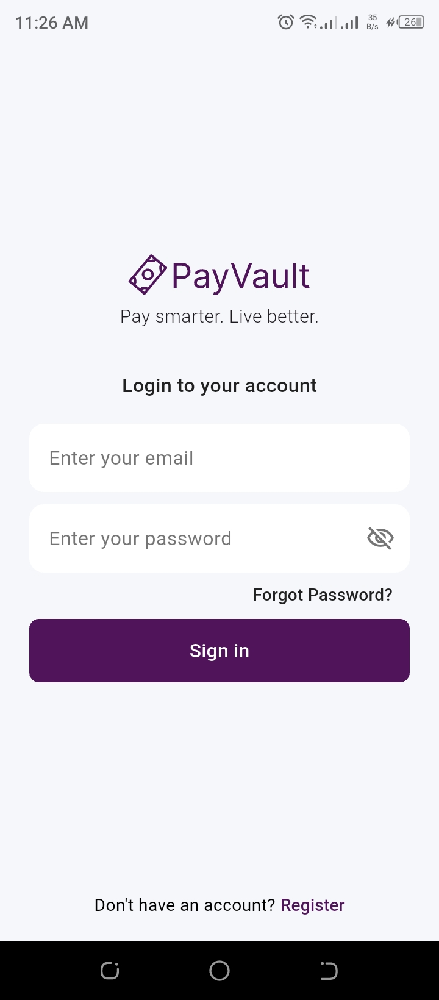
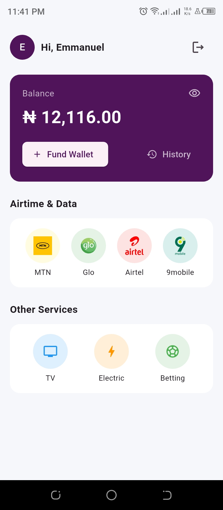
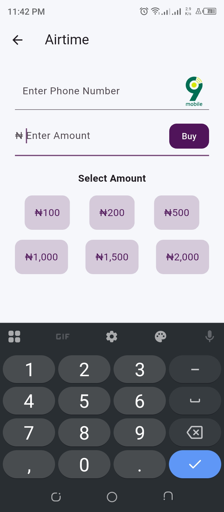
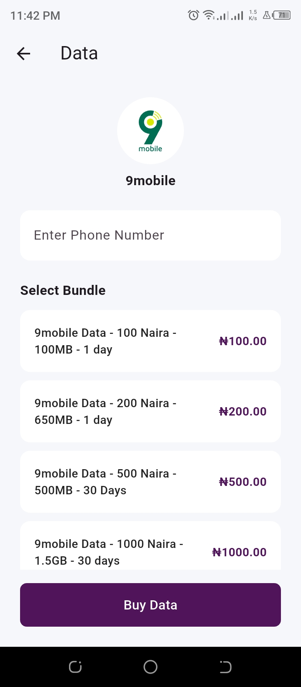
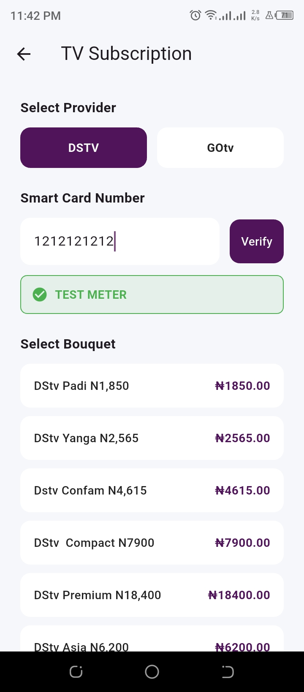
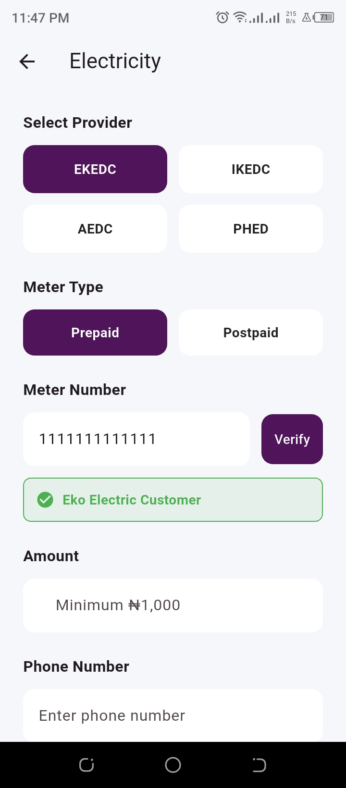
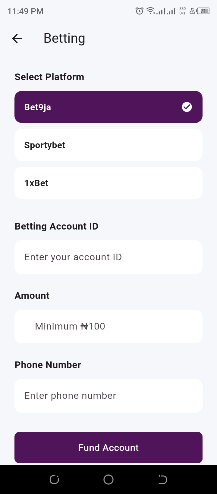
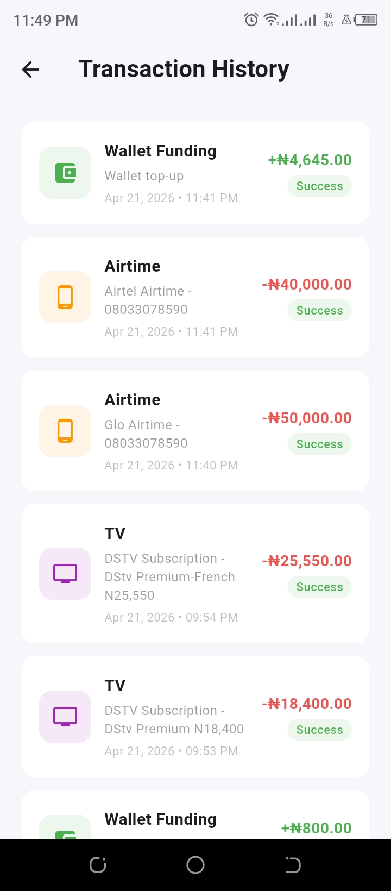

# PayVault 💳

A modern bill payment mobile app built with Flutter and Firebase, designed to simplify everyday payments with a fast, secure, and user-friendly experience.

---

## Screenshots

  
  
  
  
  
  
  
  

---

## Features

- 🔐 **Authentication** — Secure user registration, login, and email verification
- 💰 **Wallet System** — Real-time balance tracking and secure transactions
- 📱 **Airtime Purchase** — Instantly buy airtime for all major networks
- 🌐 **Data Subscription** — Purchase mobile data plans easily
- 📺 **TV Subscription** — Pay for cable TV services (DSTV & GOTV)
- ⚡ **Electricity Bills** — Seamless utility bill payments
- 🎲 **Betting Top-Up** — Fund betting wallets easily
- 📜 **Transaction History** — View all past transactions in one place
- ⚡ **Fast Payments** — Optimized flow for quick and smooth transactions
- 🔒 **Secure Integration** — Powered by VTpass API for reliable payments

---

## Built With

- [Flutter](https://flutter.dev/) — Cross-platform UI framework  
- [Firebase Authentication](https://firebase.google.com/products/auth) — User authentication  
- [Cloud Firestore](https://firebase.google.com/products/firestore) — Database  
- VTpass API — Bill payment services  

---

## Author

**Ajose Emmanuel**

